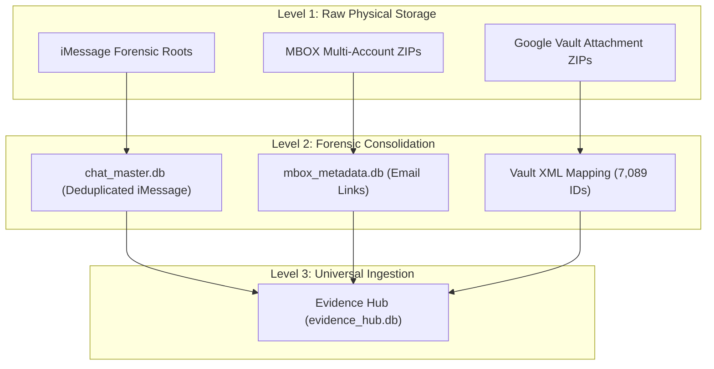

# Chain of Custody & Architectural Authority

This document defines the "Chain of Command" for the forensic evidence system, tracing data from its raw physical storage on the external drive to the unified Evidence Hub.

## 1. High-Level Architecture

The system operates as a tiered hierarchy, moving from raw forensic image to a searchable, relational knowledge base.

---

## 2. iMessage (RMSF) Hierarchy

The iMessage architecture uses RMSF as the canonical source-of-truth. iMessages only come from RMSF or are referred to from canonical RMSF-derived indexes/metadata. Raw SQLite/chat.db extraction is not primary iMessage evidence when RMSF or RMSF index coverage exists.

| Tier | Component | Description |
| :--- | :--- | :--- |
| **Primary Source** | RMSF exports/indexes | Canonical iMessage source material and index references. |
| **Reference Layer** | `chatdb_storage/` / `chat_master.db` | SQLite/chat.db-derived material is reference-only unless specifically tied back to RMSF or a canonical RMSF-derived index. |
| **Evidence Path** | RMSF attachment/reference metadata | Directs the Hub to resolve physical attachment paths through canonical RMSF-derived references. |

---

## 3. MBOX (Email) & Vault Hierarchy

The email architecture uses MBOX as the canonical source-of-truth. Emails only come from MBOX sources or are referred to from canonical MBOX-derived indexes/metadata. `.eml` files are derivative/export/reference material once the MBOX location is resolved.

| Tier | Component | Description |
| :--- | :--- | :--- |
| **Primary Source** | `MBOX_LOCKER/` | Raw Zipped MBOX files for ALL, LG, SG, and Legal accounts. |
| **Metadata Layer** | `mbox_metadata.db` | Stores all 36,318 Drive links extracted from the email bodies. |
| **Reconciliation** | `vault_mapping_full.json` | Aggregated from 8 `metadata.xml` sources. Maps unique **Drive IDs** to **Local Filenames**. |
| **Local Artifacts** | `attachments/*.zip` | Physical 9GB archives containing the attachments named by their XML-mapped IDs. |

---

## 4. Single Source of Truth (SSOT)

The **Evidence Hub (`evidence_hub.db`)** is the final authority. 

> [!IMPORTANT]
> To trace any piece of evidence back to its source:
> 1. Check the `source_type` (email vs imessage).
> 2. For **iMessage**, trace to RMSF or the canonical RMSF-derived index/metadata reference.
> 3. For **Email**, trace to MBOX or the canonical MBOX-derived index/metadata reference; disregard `.eml` as source-of-truth once MBOX location is resolved.
> 4. For **attachments**, trace the attachment to the canonical parent communication source or canonical index reference before treating it as evidence.

---
**Document Version**: 1.2.0  
**Updated**: 2026-05-10
