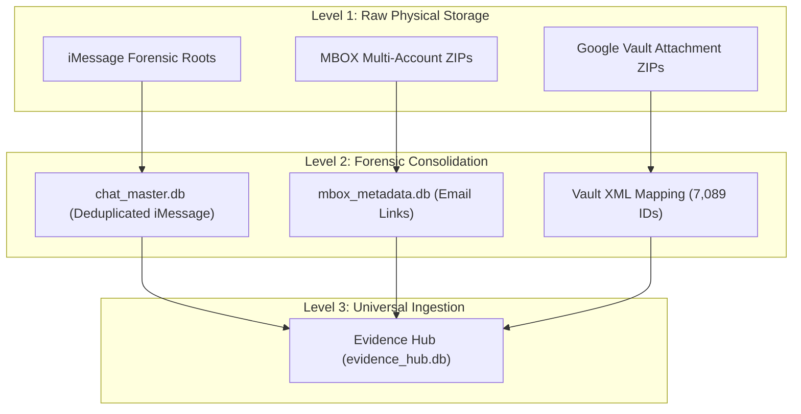

# Chain of Custody & Architectural Authority

This document defines the "Chain of Command" for the forensic evidence system, tracing data from its raw physical storage on the external drive to the unified Evidence Hub.

## 1. High-Level Architecture

The system operates as a tiered hierarchy, moving from raw forensic image to a searchable, relational knowledge base.

---

## 2. iMessage (chat.db) Hierarchy

The iMessage architecture solves the "Split History" problem by merging multiple forensic sources.

| Tier | Component | Description |
| :--- | :--- | :--- |
| **Primary Source** | `chatdb_storage/` | Contains forensic roots from the iMac and M1 Studio. |
| **Logic Layer** | `chat_master.db` | A unified database that deduplicates GUIDs across all sources and decodes `typedStream` blobs into readable text. |
| **Evidence Path** | `forensic_root_translation` | Directs the Hub to resolve physical attachment paths (e.g., `~/Library/Messages/...`) to the corresponding external drive location. |

---

## 3. MBOX (Email) & Vault Hierarchy

The email architecture solves the "Broken Drive Link" problem by using Google Vault metadata as a bridge.

| Tier | Component | Description |
| :--- | :--- | :--- |
| **Primary Source** | `MBOX_LOCKER/` | Raw Zipped MBOX files for ALL, LG, SG, and Legal accounts. |
| **Metadata Layer** | `mbox_metadata.db` | Stores all 36,318 Drive links extracted from the email bodies. |
| **Reconciliation** | `vault_mapping_full.json` | Aggregated from 8 `metadata.xml` sources. Maps unique **Drive IDs** to **Local Filenames**. |
| **Local Artifacts** | `attachments/*.zip` | Physical 9GB archives containing the attachments named by their XML-mapped IDs. |

---

## 4. Single Source of Truth (SSOT)

The **Evidence Hub (`evidence_hub.db`)** is the final authority. 

> [!IMPORTANT]
> To trace any piece of evidence back to its source:
> 1. Check the `source_type` (email vs imessage).
> 2. For **iMessage**, use the `original_guid` to find the record in `chat_master.db`.
> 3. For **Email**, use the `local_vault_filename` in the `primary_ids` metadata to locate the physical file within the ZIP archives on `/Volumes/batdrivetb5/`.
> 4. For **iMessage Attachments**, the `guid` from `chat_master.db` is cross-referenced against `chat_case_only.db` (via `message_attachment_join` → `attachment`) to resolve `~/Library/Messages/Attachments/...` paths to `data/IMESSAGE_LOCKER/Messages/Attachments/...`. Served via `/api/imessage-attachment?guid=<message-guid>`.

---
**Document Version**: 1.1.0  
**Updated**: 2026-03-22
